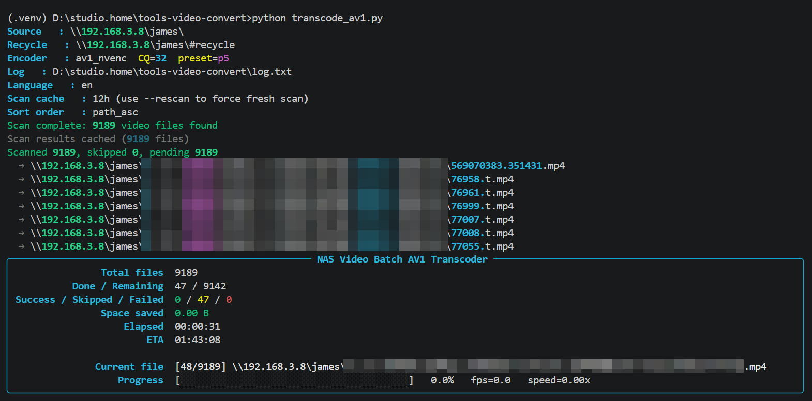

# tools-video-convert



這個專案提供 3 支可獨立使用、也可串在一起的影片維運工具，重點是：
- 批次轉檔 AV1（含安全替換、斷點續跑）
- 重複影片比對與清理（含互動式刪除）
- 失敗記錄篩選與重試控制

適用情境：NAS、家用媒體庫、檔案伺服器長時間批次處理。

---

## 工具總覽

1. `transcode_av1.py`
- 遞迴掃描來源目錄影片，轉成 AV1 `.mp4`
- 支援 `av1_nvenc`（NVIDIA GPU）與 `libsvtav1`（CPU）
- 先輸出 `*_tmp.mp4`，通過效益門檻才替換原檔
- 以 `transcode_state.json` 記錄每檔狀態，支援續跑
- 支援掃描快取、重掃、失敗重試、排序策略

2. `find_duplicate_videos.py`
- 找出「同資料夾 + 同檔名 + 不同副檔名」的重複影片
- 以 `ffprobe` 取得資訊，依畫質分數推薦保留/刪除
- 支援互動式確認、`--dry-run` 模擬刪除
- 內建相容性覆蓋規則（AV1 10-bit / MJPEG 與 H264）

3. `filter_errors.py`
- 從 `transcode_state.json` 或 `log.txt` 篩選失敗/警告
- 可依日期、關鍵字、路徑樣式過濾
- 可重置失敗記錄，讓轉檔工具下次重試

---

## 環境需求

- Python 3.9+
- Python 套件：`rich`
- `transcode_av1.py` 需要：`ffmpeg`、`ffprobe`
- `find_duplicate_videos.py` 需要：`ffprobe`

安裝：

```bash
pip install rich
```

---

## 1) transcode_av1.py

### 核心行為

- 掃描副檔名（預設）：`.mov .mpg .mpeg .avi .mp4 .mkv .wmv .flv`
- 若來源已是 AV1，會自動跳過
- 若同名 `.mp4` 已存在，會跳過並寫入狀態
- 轉檔流程：
1. 產生暫存檔 `*_tmp.mp4`
2. 比較新舊大小比例
3. 比例未達標則刪暫存並標記 `skipped`
4. 達標才把原檔移到 `RECYCLE_DIR`
5. 暫存檔改名為正式 `.mp4`

### 主要設定（`CONFIG`）

- `SOURCE_DIR`：來源目錄
- `RECYCLE_DIR`：回收目錄
- `LOG_FILE`：日誌檔（預設為腳本目錄下 `log.txt`）
- `STATE_FILE`：狀態檔（預設為腳本目錄下 `transcode_state.json`）
- `ENCODER`：`av1_nvenc` 或 `libsvtav1`
- `CQ_VALUE`：壓縮/畫質平衡
- `SIZE_THRESHOLD`：新檔比例門檻（例如 `0.8`）
- `SUBTITLE_MODE`：`copy` / `mov_text` / `ignore`
- `SCAN_CACHE_HOURS`：掃描快取有效時數（`0` 代表每次重掃）

### 指令參數

```bash
python transcode_av1.py [--lang zh|en|es|ja] [--rescan] [--reset-failed] [--sort 0|1|2]
```

- `--lang`：覆蓋顯示語言
- `--rescan`：忽略掃描快取，強制重掃
- `--reset-failed`：清掉 state 中 `failed` 記錄，讓下次重試
- `--sort`：轉檔順序
	- `0`：`path_asc`（路徑字典序，預設）
	- `1`：`size_desc`（大檔優先）
	- `2`：`recent_upload`（最近修改優先）

### 常用範例

```bash
# 預設執行
python transcode_av1.py

# 強制重掃 + 英文介面
python transcode_av1.py --rescan --lang en

# 清除失敗記錄（不執行轉檔）
python transcode_av1.py --reset-failed

# 大檔優先
python transcode_av1.py --sort 1
```

---

## 2) find_duplicate_videos.py

### 核心行為

- 遞迴掃描來源目錄，將重複候選分組
- 每組用 `ffprobe` 取影片資訊（解析度、codec、bitrate、duration、bit depth）
- 預設品質分：`解析度像素 × codec效率`
- 顯示表格後提供互動選擇：
	- `A` 全部刪除建議項
	- `S` 逐組確認
	- `N` 取消

### 內建覆蓋規則

- 若同組同時有 AV1 10-bit 與非 AV1 10-bit：優先刪 AV1 10-bit（相容性考量）
- 若同組同時有 MJPEG 與 H264：優先保留 MJPEG、刪除 H264
- 若同組時長差異超過 `DURATION_TOLERANCE_SEC`（預設 5 秒）：顯示警告

### 指令參數

```bash
python find_duplicate_videos.py [--source <路徑>] [--lang zh|en] [--dry-run]
```

- `--source`：覆蓋 `CONFIG["SOURCE_DIR"]`
- `--lang`：介面語言
- `--dry-run`：只列出會刪除的檔案，不實際刪除

### 常用範例

```bash
# 使用 CONFIG 來源掃描
python find_duplicate_videos.py

# 指定來源 + 僅模擬
python find_duplicate_videos.py --source "\\NAS\\videos" --dry-run
```

---

## 3) filter_errors.py

### 核心行為

- 預設從 `transcode_state.json` 篩選（可切換 `--from-log`）
- 依 `status`、日期區間、路徑樣式、關鍵字篩選
- 可輸出摘要、只輸出路徑、或寫到檔案
- 可重置失敗記錄或指定路徑記錄

### 指令參數

```bash
python filter_errors.py \
	[--state <state.json>] [--log <log.txt>] \
	[--from-state | --from-log] \
	[--status success|skipped|failed|all|error|warning|info] \
	[--since YYYY-MM-DD] [--until YYYY-MM-DD] \
	[--match <PATTERN>] [--error <KEYWORD>] \
	[--summary] [--paths-only] [--output <FILE>] \
	[--reset-failed] [--reset]
```

### 常用範例

```bash
# 看所有失敗（預設來源為 state）
python filter_errors.py --status failed

# 從 log 篩選 error
python filter_errors.py --from-log --status error

# 只輸出失敗檔案路徑
python filter_errors.py --status failed --paths-only

# 清除所有失敗記錄，讓下次轉檔重試
python filter_errors.py --reset-failed

# 清除指定路徑記錄（需搭配 --match）
python filter_errors.py --reset --match "*2024*"
```

---

## 建議操作流程

1. 先用 `find_duplicate_videos.py --dry-run` 盤點重複檔
2. 確認後清理重複影片
3. 執行 `transcode_av1.py` 做批次轉檔
4. 失敗檔案用 `filter_errors.py` 篩出原因
5. 修正參數後，用 `--reset-failed` 進行重試

---


